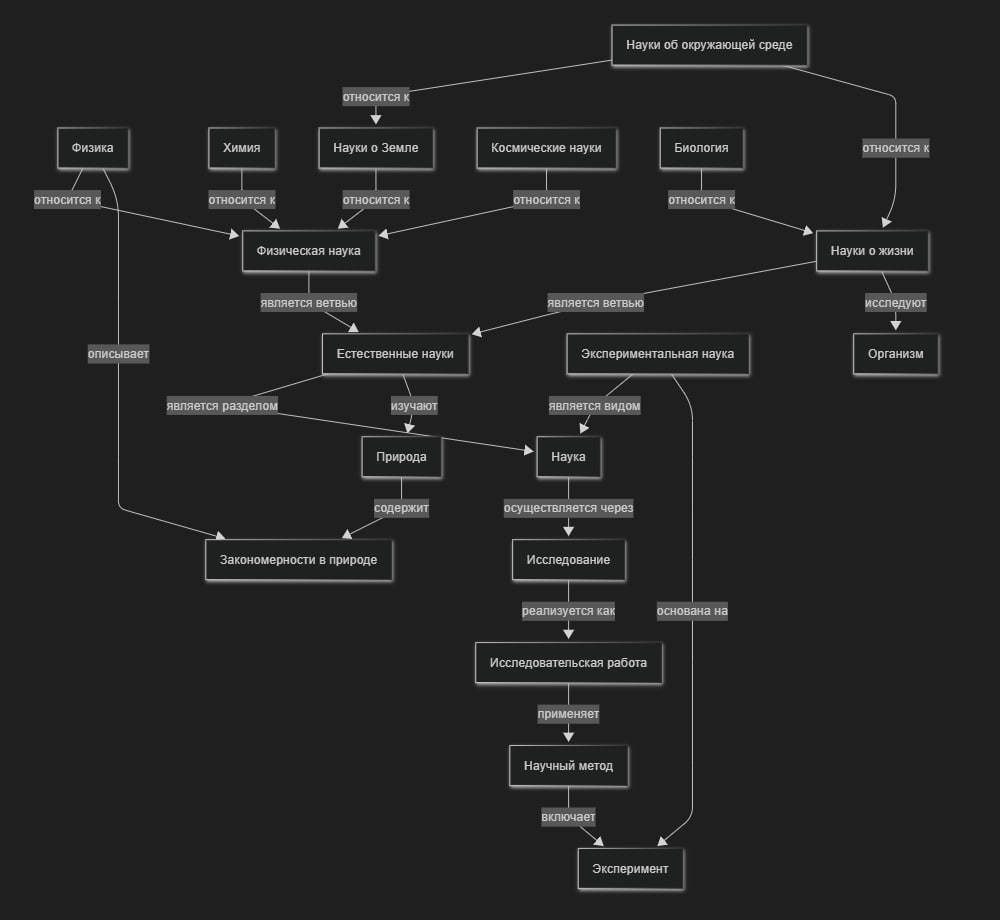

# Раздел «Почему наука помогает понимать мир»

## Постановка задачи

Раздел энциклопедии отвечает на вопрос: *почему наука — лучший инструмент для понимания мира?*
18 понятий, охватывающих объекты изучения, научные дисциплины и методы познания.

---

## Работа с базами знаний

Источник — [Wikidata Query Service](https://query.wikidata.org/). SPARQL-запрос: [`sparql_query.rq`](sparql_query.rq).

Типы отношений:

| Свойство | Название | Пример |
|----------|----------|--------|
| P31  | instance of | Эксперимент → Исследование |
| P279 | subclass of | Биология → Науки о жизни |
| P361 | part of | Физика → Естественные науки |
| P1269 | facet of | — |
| P2578 | studied by | Природа → Естественные науки |
| P1552 | has characteristic | Экспериментальная наука → Эксперимент |

### Идентификаторы Wikidata

| Понятие | QID |
|---------|-----|
| Наука | Q336 |
| Исследование | Q42240 |
| Естественные науки | Q7991 |
| Экспериментальная наука | Q5769081 |
| Физика | Q413 |
| Науки о Земле | Q8008 |
| Науки об окружающей среде | Q188847 |
| Науки о жизни | Q864928 |
| Биология | Q420 |
| Эксперимент | Q101965 |
| Исследовательская работа | Q118563234 |
| Природа | Q7860 |
| Физическая наука | Q14632398 |
| Космические науки | Q1195766 |
| Научный метод | Q46857 |
| Закономерности в природе | Q3455898 |
| Химия | Q2329 |
| Организм | Q7239 |

---

## Концептуализация и онтология

18 понятий разбиты на 4 группы:

1. **Объекты изучения:** Природа, Закономерности в природе, Организм
2. **Дисциплины:** Наука, Естественные науки, Экспериментальная наука, Физическая наука, Физика, Химия, Науки о Земле, Науки об окружающей среде, Науки о жизни, Биология, Космические науки
3. **Методология:** Научный метод, Эксперимент
4. **Деятельность:** Исследование, Исследовательская работа

Типы связей:
- **Иерархические (is-a / part-of):** Биология *является разделом* Наук о жизни
- **Горизонтальные:** Естественные науки *изучают* Природу; Исследовательская работа *применяет* Научный метод

### Схема онтологии



---

## Генерация текстов

Статьи сгенерированы через GigaChat API (скрипт [`generate_articles.py`](generate_articles.py)) в стиле «объясни для десятилетнего ребёнка». Результат — в `WEB/science/`. Список понятий — в [`concepts.json`](concepts.json).

---

## Расстановка перекрёстных ссылок

Скрипт [`generate_links.py`](generate_links.py) находит первое вхождение каждого понятия в тексте и оборачивает его в markdown-ссылку. Для обработки падежей используется `pymorphy3`.

```bash
pip install pymorphy3
python WORK/science/generate_links.py
```
